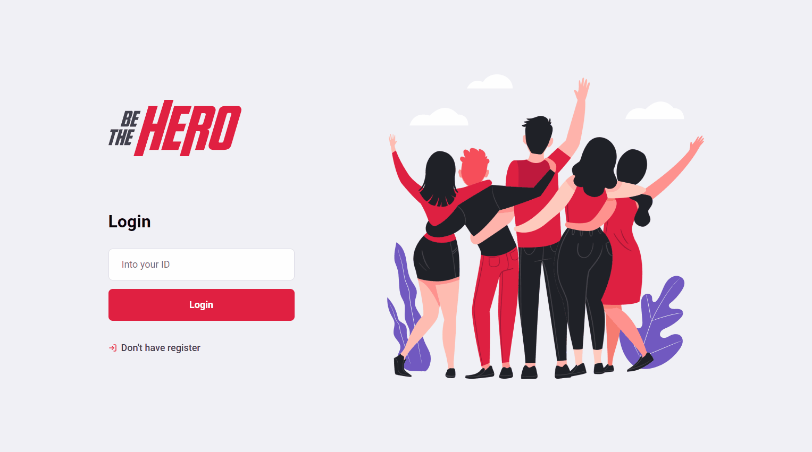

<h1 align="center">
 
  
 
 
Be The Hero
</h1>

It is an application that is responsible for recording incidents so that other people can take the case and be the hero of the day

  

[//]: # "Add your gifs/images here:"

   
  

## Features

[//]: # "Add the features of your project here:"

This app features all the latest tools and practices in mobile development!

- ⚛️ **React Js** — A JavaScript library for building user interfaces
- ⚛️ **React Native** — A lib that provides a way to create native apps for Android and iOS
- 💹 **Node Js** — A web framework for Node Js
- ✔ **Jest** - A library for test of integration and unit
- 🧾 **BD SQLite** - A database

## Getting started

**Getting started with the backend app**

1. Move yourself to the backend folder: `cd backend`
2. Run `yarn install` to install dependencies
3. Run `yarn dev` to start server

**Getting started with the frontend app**

1. Move yourself to the frontend folder: `cd frontend`
2. Run `yarn install` to install dependencies
3. Run `yarn start` to start web application

**Getting started with the mobile app**

1. Move yourself to the mobile folder: `cd mobile`
2. Run `yarn install` to install dependencies
3. Run `yarn start` to start mobile application

**Routes in Insomnia**

Import to insominia for test all routes

## License

This project is licensed under the MIT License - see the [LICENSE](https://opensource.org/licenses/MIT) page for details.
